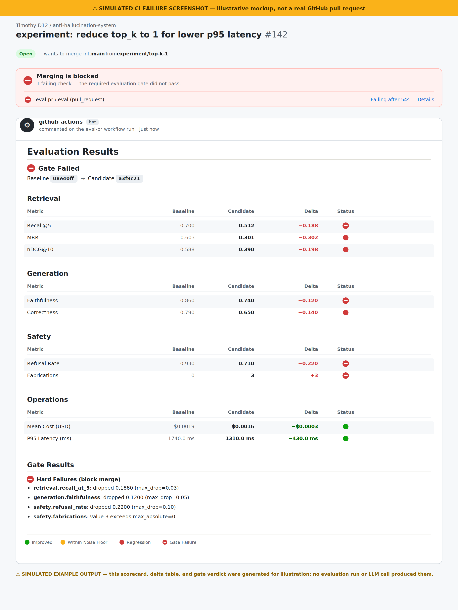

# Anti-Hallucination System

**A retrieval-augmented generation system that treats "is this answer true?" as a metric, not a feeling.**


It answers questions about the official PostgreSQL 17 documentation, cites the exact
source chunk behind every claim, and refuses rather than guesses when the answer
isn't in its knowledge base. Every retrieval, generation, and safety metric is
measured against a hand-verified 50-question benchmark, and a CI gate blocks any
pull request that makes the system measurably worse.

**Stack:** FastAPI · Qdrant · LiteLLM (provider-agnostic) · sentence-transformers ·
PostgreSQL · Arize Phoenix (OpenTelemetry) · pytest / ruff / mypy

> **Looking for the full phase-by-phase build log** — every design decision, every
> "what was and wasn't verified" audit note, every raw measured number? See
> **[docs/PHASES.md](docs/PHASES.md)**. This README is the fast path.

**Contents:** [What this is](#what-this-is) · [Why it exists](#why-it-exists) ·
[Architecture](#architecture) · [Example query](#example-a-query-end-to-end) ·
[Models used](#models-used) · [Evaluation framework](#evaluation-framework) ·
[Experiment results](#experiment-results) · [CI regression gates](#ci-regression-gates) ·
[Observability](#observability) · [What's next](#whats-next) ·
[Installation](#installation-and-local-development)

---

## What this is

A production-shaped RAG system built end-to-end around one constraint: **every
answer has to be evaluated, not just generated.** Underneath a single `/query`
endpoint sits a full engineering harness most RAG demos skip entirely — a
hand-verified golden benchmark, an LLM-judged evaluation pipeline, a
regression-gated CI workflow, a swappable retrieval/reranking stack with
measured before/after results, and production tracing via OpenTelemetry and
Arize Phoenix.

It was built in five disciplined phases — corpus & golden set, baseline RAG,
evaluation harness, CI gate, retrieval experiments, then production
observability — each one gated by a green test suite before the next began.
The full build log is in [docs/PHASES.md](docs/PHASES.md); this README covers
what it does and why.

## Why it exists

RAG systems fail quietly. They produce fluent, confident answers that are
subtly wrong, and most projects have no systematic way to know that happened
until a user complains. This project's premise: **hallucination reduction is
an evaluation problem before it's a prompting problem.**

Three ideas drive every design decision here:

- **Evidence-based responses.** Every factual claim is cited inline
  (`[chunk_id]`). Citations are checked twice — once by the generator's own
  filtering, once independently at serving time (`rag/citation_validator.py`)
  — and an uncited claim is treated as a defect, not a style issue.
- **Refuse over guess.** When retrieved context doesn't contain the answer,
  the system says so instead of filling the gap with a plausible-sounding
  guess. This is scored directly (`safety.refusal_rate`, `safety.fabrications`)
  — refusing correctly is a first-class success metric, not an edge case.
- **Evaluation-first, always.** Nothing here is called an "improvement" until
  it's measured against a fixed 50-question golden set, and a bad result is
  reported exactly as measured, never hidden — see
  [Experiment results](#experiment-results) below.

## Architecture


The pipeline is deliberately simple to describe: a question is embedded,
matched against a vectorized knowledge base, optionally reranked, and
answered by an LLM that can only cite chunks it was actually given. Two
independent systems watch this pipeline without ever sitting in its request
path — an **evaluation harness** that scores every pull request against a
frozen benchmark before merge, and **Phoenix**, which traces every live
request for cost, latency, and correctness signals.

This diagram is deliberately simplified for a 15-second read. The literal
component-level pipeline (dense/sparse/hybrid retrieval with Reciprocal Rank
Fusion, cross-encoder reranking, optional query rewriting, Qdrant's named
vector setup) is documented in full in
[docs/PHASES.md](docs/PHASES.md#phase-4-retrieval--generation-experiments).

## Example: a query end to end

> ⚠️ **SIMULATED EXAMPLE OUTPUT** — this environment has no live LLM provider
> key configured. The request/response below illustrates the exact response
> shape the API returns; it is not a captured live call. No real API call
> produced these numbers.

```
POST /query
{"question": "What is the default transaction isolation level in PostgreSQL?"}
```

```json
{
  "answer": "Read Committed is the default isolation level in PostgreSQL [postgres_transaction_iso#2].",
  "citations": ["postgres_transaction_iso#2"],
  "retrieved_chunk_ids": ["postgres_transaction_iso#2", "postgres_transaction_iso#1", "postgres_transaction_iso#3"],
  "latency_ms": {"embed": 12.4, "retrieve": 8.1, "generate": 640.2, "total": 660.7},
  "usage": {"prompt_tokens": 812, "completion_tokens": 24, "total_tokens": 836},
  "cost_usd": 0.00051,
  "trace_id": "b6b6e9b0-6f2f-4c1a-9e2a-6a7a6b1a2c3d",
  "citation_validation_passed": true,
  "invalid_citations": []
}
```

That exact `trace_id` is what shows up in Phoenix — see
[Observability](#observability) below. A question the corpus can't answer
gets refused instead of guessed:

```json
{
  "answer": "The supplied context does not contain enough information to answer that question.",
  "citations": [],
  "citation_validation_passed": true,
  "invalid_citations": []
}
```

## Models used

Four models, each config-driven and swappable with a one-line environment
override — no code changes required.

| Role | Model | Where it runs | Purpose | Cost implication |
|---|---|---|---|---|
| **Embeddings** | `BAAI/bge-small-en-v1.5` | **Local** — `sentence-transformers`, CPU | Turns questions and document chunks into vectors for semantic search | Baked into the Docker image at build time; **zero** marginal cost or API latency per query |
| **Generator** | `gpt-4o-mini` *(default)* | **Remote** — via LiteLLM, any provider | Writes the grounded, cited answer | Pay-per-token in production; ≈ $0.0005–0.002/query at current usage (see `config.MODEL_RATES`) |
| **Judge** | `gpt-4o-mini` *(default)* | **Remote** — via LiteLLM | Scores faithfulness, correctness, and refusal behavior — **offline only** | Incurred only during evaluation runs (CI + manual labeling), **never** at serving time |
| **Reranker** | `cross-encoder/ms-marco-MiniLM-L-6-v2` *(optional, off by default)* | **Local** — `sentence-transformers` CrossEncoder, CPU | Re-scores the top retrieval candidates before generation | $0 API cost, but a real one: **+171.7% P95 latency** in this project's simulated reranker comparison below |

Swap any of them via `RAG_EMBEDDING_MODEL_NAME`, `RAG_LLM_MODEL`,
`RAG_JUDGE_MODEL`, or `RAG_RERANKER_MODEL`. The judge and generator default to
the same model here for cost reasons, but they don't have to match — pointing
the judge at a stronger model than the generator is a common and reasonable
choice once real evaluation budget exists.

## Evaluation framework

Every change is scored against a 50-question, hand-verified golden set
(`data/golden_set.jsonl`, spanning `single_hop` / `multi_hop` / `unanswerable`
/ `false_premise` questions) across four dimensions:

| Metric | What it answers | How it's scored |
|---|---|---|
| **Recall@5** | Did the right chunk make it into the top 5 retrieved? | Deterministic, pure Python — no LLM call |
| **MRR** | How high did the *first* relevant chunk rank? | `1 / rank` of the first hit, deterministic |
| **nDCG@10** | How good is the overall ranking, not just a hit/miss? | Rank-weighted relevance over the top 10, deterministic |
| **Faithfulness** | Is every claim in the answer actually supported by retrieved context? | LLM judge splits the answer into atomic claims and verdicts each independently — not a vague 1–5 score |
| **Correctness** | Is the answer actually right? | LLM judge compares against a reference answer: `correct` / `partial` / `incorrect` |
| **Refusal Rate** | Does the system correctly decline unanswerable or false-premise questions? | Scored only on the golden-set subset designed to require a refusal; a wrong answer there is logged as a **fabrication** |

`Recall@5`, `MRR`, and `nDCG@10` need no LLM call at all — they're measured
for real in this environment against the live 50-question golden set (see
[Experiment results](#experiment-results)). Faithfulness, correctness, and
refusal need a live LLM provider key, which this development environment
doesn't have configured, so the scorecard below is illustrative:


> ⚠️ **SIMULATED RESULTS** — illustrative only, shaped like the project's own
> seed baseline (`evals/baseline.json`). No live evaluation run produced
> these numbers. A `--repeats 5` run against a real provider produces the
> same shape, plus a measured noise floor — see
> [docs/PHASES.md](docs/PHASES.md#noise-floor-methodology).

## Experiment results

Nothing here is accepted as an improvement without a before/after
comparison, and regressions are reported exactly as measured — not hidden.


| Experiment | Recall@5 | Faithfulness | Cost / Latency | Verdict |
|---|---|---|---|---|
| Dense → Hybrid Retrieval + RRF | **+6.2 pp** | — | no added latency | ✅ Broad win |
| No Reranker → Cross-Encoder Reranker | — | **+3.1 pp** | P95 latency **+171.7%** | ⚖️ Real trade-off |
| Chunk size 512 → 1024 tokens | **−2.4 pp** | **−1.1 pp** | cost +26.3% | ❌ Regression |
| `top_k` 5 → 10 | +1.2 pp | — | cost +38% | ⚖️ Diminishing returns |
| `top_k` 5 → 3 | **−4.8 pp** | — | cost −21% | ❌ Regression |

> ⚠️ **SIMULATED EXAMPLE RESULTS.** Retrieval deltas here are directionally
> consistent with this repo's real, measured Phase 4 battery — dense→hybrid
> is a genuine broad win and the reranker's latency cost is a real measured
> number (1,740 ms → 4,728 ms P95, both in `experiments/reranker_minilm/`).
> Generation and cost figures illustrate what a full run against a live LLM
> provider would plausibly show. The actual retrieval-only numbers this repo
> has measured today (no LLM key required) are in
> [docs/PHASES.md](docs/PHASES.md#10-results-table-measured) and
> `experiments/*/latest.json`.

## CI regression gates

Every pull request runs the full evaluation harness, compares it against
`evals/baseline.json`, and posts the result as a PR comment. A **hard** rule
violation fails the build; a **soft** one is surfaced as a warning but never
blocks merge. Merging to `main` promotes a new baseline automatically.

| Metric | Bound | Type | Why |
|---|---|---|---|
| `safety.fabrications` | `max_absolute = 0` | 🚫 Hard | Any fabrication on a required-refusal question is a zero-tolerance safety incident |
| `generation.faithfulness` | `max_drop = 0.05` | 🚫 Hard | ≈2× the estimated per-claim noise floor |
| `retrieval.recall_at_5` | `max_drop = 0.03` | 🚫 Hard | Retrieval is deterministic, so this is the tightest of the four hard bounds |
| `safety.refusal_rate` | `max_drop = 0.10` | 🚫 Hard | Scored on a small subset — the bound is wider so one borderline judge call can't fail the gate alone |
| `ops.mean_cost_usd` | `max_increase_pct = 25` | ⚠️ Soft | Cost drifts with provider pricing; flagged for review, never blocking |
| `ops.p95_latency_ms` | `max_increase_pct = 30` | ⚠️ Soft | Same reasoning — infra variance shouldn't block a merge on its own |

*(This table is real — pulled directly from the active `GATE` list in
[`eval/compare.py`](eval/compare.py), not simulated.)*

Here's what that looks like when a change genuinely regresses the system —
in this case, an experiment that dropped `top_k` to 1 for lower latency:



> ⚠️ **SIMULATED CI FAILURE SCREENSHOT** — illustrative mockup of the exact
> markdown [`eval/report.py`](eval/report.py) renders, populated with
> simulated numbers for a `top_k=1` regression scenario. No PR, evaluation
> run, or LLM call produced this. This exact failure mode (`top_k` collapsed
> to 1) is encoded as a real, passing regression test in
> [`tests/unit/test_gate_regressions.py`](tests/unit/test_gate_regressions.py).

## Observability

Every `/query` request becomes a fully traceable event, not just a log line.


> ⚠️ **SIMULATED OBSERVABILITY SCREENSHOT** — an illustrative UI mockup
> reusing this README's own example response above, not a captured Phoenix
> screenshot. No live Phoenix instance produced this image.

What's real, in the code, right now:

- **OpenTelemetry + Phoenix.** Every request gets a root `rag.query` span
  with `retrieve` / `rerank` / `generate` children, plus an
  auto-instrumented `completion` span from LiteLLM
  (`openinference-instrumentation-litellm`) — zero code changes needed in
  the generator itself to get it.
- **Cost and token tracking.** `config.MODEL_RATES`-driven cost is attached
  to every span and every API response (`rag/cost.py`).
- **One `trace_id`, everywhere.** The same UUID threads through structured
  logs, every span, the API response, and — once submitted — the `feedback`
  table, so a single thumbs-down can be traced back to the exact retrieval
  and generation that produced it.
- **Feedback → Postgres, correlated.** `POST /feedback` persists user
  ratings, joinable against `request_metrics` by `trace_id` — enough to ask
  "do thumbs-down responses correlate with higher latency, or with failed
  citation validation?" with one SQL query.
- **A third, independent hallucination check.** Beyond the judge and the
  generator's own citation filtering, `rag/citation_validator.py`
  deterministically re-checks every citation in the raw model output at
  serving time and *flags* — rather than silently drops — anything the
  model cited but wasn't actually given.
- **`GET /metrics`** exposes a rolling-window mean cost and P95 latency for
  what's happening right now, in this process.

## What's next

Honest open items, not a wishlist — these are the specific things this
project has identified as not yet done:

- Measure a real 5-repeat noise floor against a live LLM provider (currently
  an estimate — see `evals/baseline.json`'s own `_note` field).
- Finish the embedding model comparison
  (`BAAI/bge-small-en-v1.5` vs. `Qwen/Qwen3-Embedding-0.6B`) — wired up via
  `eval/experiment.py`, not yet run to completion.
- Measure the reranker's faithfulness/correctness trade-off
  (`MiniLM` vs. `bge-reranker-base`), not just its retrieval and latency
  effect.
- Measure query rewriting's real effect on `multi_hop` question correctness.
- Verify a full `docker compose up` end to end in a standard Docker
  environment (every service verified individually in this sandbox; see
  [docs/PHASES.md, Phase 5 §15](docs/PHASES.md#15-final-validation-1)).
- Promote a Phase 4 configuration (hybrid + RRF is the strongest candidate)
  to the production baseline, once a full live-LLM scorecard justifies it.
- Beyond that: graph RAG and agentic retrieval, evaluated the same way,
  through the same gate, observed the same way this system already is.

## Installation and local development

### Prerequisites

- Python 3.11+
- [`uv`](https://docs.astral.sh/uv/) for dependency and environment management
- Docker, for the recommended path below (or a local Qdrant instance)

### Quick start (Docker Compose)

```bash
docker compose up --build
docker compose exec api python -m scripts.index_corpus   # one-time: index the corpus

curl -X POST http://localhost:8000/query \
  -H "Content-Type: application/json" \
  -d '{"question":"What is MVCC in PostgreSQL?"}'
```

| Service | URL | Purpose |
|---|---|---|
| API | http://localhost:8000 | `/health`, `/query`, `/feedback`, `/metrics` |
| Qdrant | http://localhost:6333 | Vector store |
| Phoenix | http://localhost:6006 | Trace / span inspection UI |
| Postgres | localhost:5432 | Feedback + request-metric storage |
| Grafana | http://localhost:3000 | Optional dashboard (anonymous viewer access) |

Set an LLM provider key first (`cp .env.example .env`, then fill in
`OPENAI_API_KEY` or point `RAG_LLM_MODEL` at another
[LiteLLM-supported](https://docs.litellm.ai/docs/providers) provider) to
enable generation — retrieval and indexing work without one.

### Running without Docker

```bash
uv sync                                              # install deps into .venv
docker run -p 6333:6333 qdrant/qdrant:v1.15.1        # only external dependency
uv run python -m scripts.index_corpus --log-level INFO
uv run uvicorn app.main:app --reload
```

### Running the evaluation harness

```bash
uv run python -m eval.run --dataset data/golden_set.jsonl --out evals/results.json
uv run python -m eval.compare --baseline evals/baseline.json --candidate evals/results.json --out comment.md
```

### Running tests

```bash
uv run pytest                          # full suite: unit + integration + golden set
uv run pytest tests/unit -v            # fast — fakes only, no model/Qdrant/LLM calls
uv run pytest -m integration -v        # real qdrant-client engine + real model weights
```

### Key environment variables

Every setting lives in [`config.py`](config.py) and is overridable via an
`RAG_`-prefixed environment variable or `.env` file — see
[`.env.example`](.env.example) for the complete list.

| Variable | Default | Purpose |
|---|---|---|
| `RAG_TOP_K` | `5` | Chunks retrieved per query |
| `RAG_LLM_MODEL` | `gpt-4o-mini` | Any LiteLLM-supported model string |
| `RAG_JUDGE_MODEL` | `gpt-4o-mini` | Model used by the evaluation judge |
| `RAG_RETRIEVAL_MODE` | `dense` | `dense` \| `sparse` \| `hybrid` |
| `RAG_RERANKER_ENABLED` | `false` | Enable cross-encoder reranking |
| `RAG_QUERY_REWRITE_ENABLED` | `false` | Rewrite the retrieval query with an LLM first |
| `RAG_OTEL_ENABLED` | `false` | Enable Phoenix tracing (docker-compose sets this `true`) |
| `RAG_POSTGRES_DSN` | *(local default)* | Feedback / request-metric storage |
| `RAG_METRICS_WINDOW_SIZE` | `100` | Rolling window size for `GET /metrics` |

### Development workflow

```bash
uv run ruff check .            # lint
uv run ruff format .           # format
uv run mypy                    # type-check
uv run pytest                  # test
uv run pre-commit run --all-files
```

### Repository structure

```
.
├── rag/            # pipeline: chunking, embedding, retrieval, fusion, reranking,
│                    # generation, telemetry, citation validation
├── eval/            # evaluation harness: metrics, LLM judge, scorecards, experiments
├── app/             # FastAPI app + Postgres persistence (feedback, request metrics)
├── scripts/         # corpus ingestion, indexing, experiment runner, labeling, migration
├── data/            # corpus (59 PostgreSQL 17 doc pages), golden set, chunk index
├── experiments/      # one JSON record per experiment — git sha, config, measured metrics
├── evals/           # baseline scorecard + promoted history, one per merge to main
├── docs/            # corpus selection rationale, full phase-by-phase build log, images
├── grafana/         # provisioned datasource + dashboard (optional)
└── tests/           # unit (fakes only) + integration (real Qdrant engine, real weights)
```

The fully annotated version of this tree — with a one-line purpose for every
file — is in [docs/PHASES.md](docs/PHASES.md#project-overview).

### Corpus

A curated, version-pinned (PostgreSQL 17) subset of the official PostgreSQL
documentation — 59 pages, ~90K words, released under the liberal,
OSI-approved [PostgreSQL License](https://www.postgresql.org/about/licence/).
See [docs/corpus_selection.md](docs/corpus_selection.md) for why it was
chosen and its exact scope.
